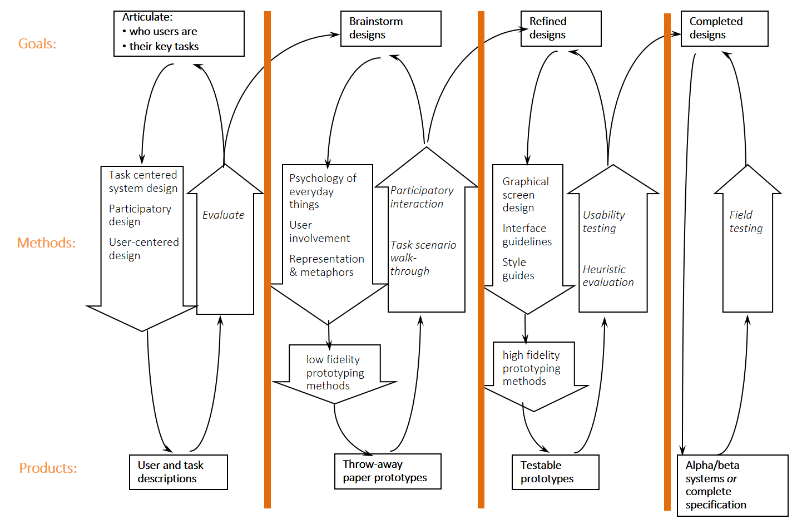

# Korisnička sučelja <!-- omit in toc -->

_Pripremili: Ivan Kuliš i Mario Čagalj_

<!-- markdownlint-disable MD007 -->

- [Uvod](#uvod)
- [Što se očekuje od studenta](#što-se-očekuje-od-studenta)
- [Zadaće i korisnici koje aplikacija treba podržati](#zadaće-i-korisnici-koje-aplikacija-treba-podržati)
- [Demonstracija projekta - tehnički zahtjevi](#demonstracija-projekta---tehnički-zahtjevi)
- [Praktičan uvod u Git, JavaScript, React i Gatsby](#praktičan-uvod-u-git-javascript-react-i-gatsby)
- [Primjeri izvještaja](#primjeri-izvještaja)

## [HCI vježbe](https://github.com/n00ne1mportant/HCi_2020_Fresh)<!-- omit in toc -->

## FESB, Računarstvo, 2020/21 <!-- omit in toc -->

Osnovni cilj predmeta **Korisnička sučelja** je upoznati studente s važnim aspekatima procesa dizajna (sučelja) usmjerenog krajnjim korisnicima. Studenti će realizirati praktičan projekt u okviru kojeg će primjeniti odgovarajuće principe _dobrog dizajna_. Također imati priliku upoznati koristiti moderne tehnologije/alate za dizajn i implementaciju _front-end_ (kao i _back-end_) aplikacija ([React.js](https://reactjs.org), [GraphQL](https://graphql.org), [Figma](https://www.figma.com) i druge).

## Uvod

Izrada projekta odvijati će se u nekoliko faza kako je to prikazano na slici u nastavku. Kako možemo vidjeti na slici, dizajn je iterativni postupak u kojem iteriramo faze _dizajna_, _implementacije_ i _evaluacije_.

<!-- markdownlint-disable MD033 -->

    
      
    <em>Iterative design process (source: <a href="http://saul.cpsc.ucalgary.ca/pmwiki.php/HCIResources/HCILectures">Saul Greenberg</a>)</em>

<!-- markdownlint-disable MD033 -->

Ugrubo, razlikujemo sljedeće faze u ovom procesu:

1. **Razumijevanje zadaća i korisnika koje sustav/aplikacija treba podržati**
  
   > Vi niste tipičan korisnik. Ne znate koje zadaće su važne korisnicima. Da bi bili sigurni da imate dobar opis zadaća trebate ih evaluirati zajedno s korisnicima.
   >
   > _Feature_-i nisu zadaće koje korisnik treba obaviti. Gomilanjem _feature_-a vaša aplikacija neće biti bolja već upravo suprotno. Razumijevanje stvarnih potreba korisnika i stvarnih zadaća koje korisnik treba izvršiti ključ je uspjeha.

2. **Izrada _low-fidelity_ i _high-fidelity_ prototipa i njihova evaluacija**

   > Pokušajte odoljeti programerskom porivu da u ovoj fazi otvorite vaš preferirani editor i započnete programirati. U ovoj fazi razvoja projekta vaš _dobar prijatelj_ su olovka i papir, razni grafički editori (npr. [Inkscape](https://inkscape.org/en/)), te alati za brzu izradu prototipa (npr. [Figma](https://www.figma.com), [Balsamiq](https://balsamiq.com), [Sketch](https://www.sketchapp.com), [inVision](https://www.invisionapp.com), [Draw.io](https://www.draw.io/)). 
   >
   > Provedite evaluaciju vašeg prototipa s kolegama ili profesorima i popravite uočene _usability bug_-ove.

3. **Implementacija prototipa i njegova evaluacija**

   U ovoj fazi konačno možete otvoriti svoj preferirani editor i započeti s implementacijom.

   > Nemojte zaboraviti na evaluaciju u ovoj fazi (provedite _heurističku evaluaciju_ vašeg produkta i/ili _usability testing_ sa stvarnim korisnicima).

## Što se očekuje od studenta

Student će razviti odgovarajuću web aplikaciju korištenjem navedenih tehnologija i alata. Od gore navedene tri faze iterativnog procesa dizajna, student će realizirati samo dvije:

- Fazu 2: Izrada i evaluacija _low-fidelity_ i _high-fidelity_ prototipa
  - Olovka i papir i/ili [Figma](https://www.figma.com) (za _high-fidelity_)
- Fazu 3: Implementacija sustava i njegova evaluacija
  - [Gatsby.js](https://www.gatsbyjs.org)

Student će također pripremiti kratak izvještaj o realiziranom projektu (primjeri izvještaja dostupni su u direktoriju [docs](docs/)).

## Zadaće i korisnici koje aplikacija treba podržati

### Zahtjevi i zadaće <!-- omit in toc -->

- Vaša aplikacija će se koristiti iz web preglednika
- Aplikacija će se koristiti na uređajima razičite veličine (_smartphones_, tableti, laptopi i desktop računala)
- Korisnik može pretraživati/filtrirati produkte ili usluge
- Broj produkata/usluga koje nudite putem web aplikacije veći je od 20
- Korisnik će koristiti aplikaciju kao gost ili će se logirati u vlastiti profil
- Broj _javnih_ stranica (one stranice koje ne zahtjevaju logiranje u sustav) je 5
- Jedna od javnih stranica je blog (blog mora sadržavati minimalno 20 _postova_ koje mogu uključivati slike, videa, _code snippet_-e)

### Korisnici <!-- omit in toc -->

- Vaša aplikacija namjenjena je širokom krugu korisnika
- Baza korisnika uključuje i osobe čija informatička pismenost ne mora nužno biti na vašoj razini
- Korisnici tako mogu biti i _osobe starije životne dobi_ (60 i više godina) koje sporo tipkaju, imaju slabiji vid, imaju slab sluh

## Demonstracija projekta - tehnički zahtjevi

- Studenti će pokazati optimiziranu produkcijsku verziju projekta; u tom smislu [Gatsby.js](https://www.gatsbyjs.org) će za vas odraditi _heavy lifting_ na projektu
- Produkcijska verzija projekta treba biti postavljena _online_ na odgovarajuću _cloud_ platformu ([Netlify](https://www.netlify.com/), [Heroku](https://www.heroku.com/), [Azure](https://azure.microsoft.com))
- Studenti analizirati performanse aplikacije korištenjem odgovarajućih alata (npr. [PageSpeed Insights](https://developers.google.com/speed/pagespeed/insights/), [Webpagetest](https://www.webpagetest.org/))

## Praktičan uvod u Git, JavaScript, React i Gatsby

U uvodnom dijelu labova student će izraditi demo stranicu korištenjem navedenih tehnologija uz našu asistenciju - Ivan Kuliš (student) i Mario Čagalj (profesor).

> Profesor ovim putem posebno zahvaljuje Ivan Kulišu na vremenu i ogromnom naporu uloženom u pripremu vježbi.

**Vježbe s detaljnim uputama i smjernicama nalaze se u sljedećem repozitoruju:**
[HCI vježbe](https://github.com/n00ne1mportant/HCi_2020_Fresh)

## Primjeri izvještaja

U direktoriju [docs](docs/) možete naći nekoliko primjera izvještaja o radu na projektu _starijih kolega_.
